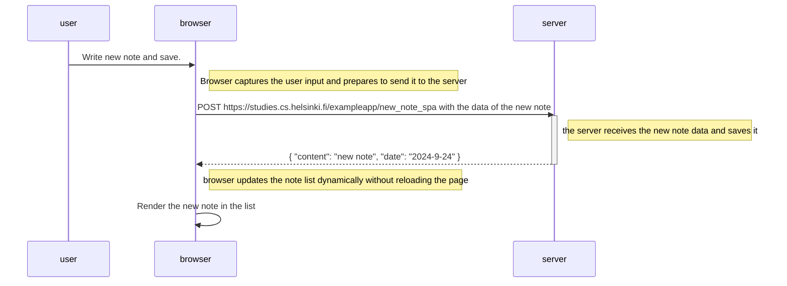

```mermaid
sequenceDiagram
    participant user
    participant browser
    participant server

    user->>browser: Write new note and save.
    Note right of browser: Browser captures the user input and prepares to send it to the server

    browser->>server: POST https://studies.cs.helsinki.fi/exampleapp/new_note_spa with the data of the new note
    activate server
    Note right of server: the server receives the new note data and saves it
    server-->>browser: { "content": "new note", "date": "2024-9-24" }
    deactivate server

    Note right of browser: browser updates the note list dynamically without reloading the page
    browser->>browser: Render the new note in the list

```
