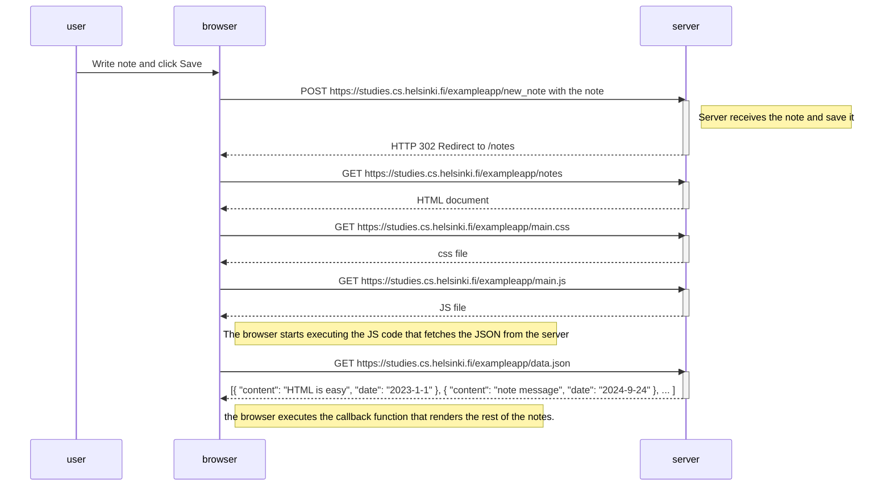

```mermaid
sequenceDiagram
participant user
participant browser
participant server

    user->>browser: Write note and click Save

    browser->>server: POST https://studies.cs.helsinki.fi/exampleapp/new_note with the note
    activate server
    Note right of server: Server receives the note and save it
    server-->>browser: HTTP 302 Redirect to /notes
    deactivate server

    browser->>server: GET https://studies.cs.helsinki.fi/exampleapp/notes
    activate server
    server-->>browser: HTML document
    deactivate server

    browser->>server: GET https://studies.cs.helsinki.fi/exampleapp/main.css
    activate server
    server-->>browser: css file
    deactivate server

    browser->>server: GET https://studies.cs.helsinki.fi/exampleapp/main.js
    activate server
    server-->>browser: JS file
    deactivate server

    Note right of browser: The browser starts executing the JS code that fetches the JSON from the server

    browser->>server: GET https://studies.cs.helsinki.fi/exampleapp/data.json
    activate server
    server-->>browser: [{ "content": "HTML is easy", "date": "2023-1-1" }, { "content": "note message", "date": "2024-9-24" }, ... ]
    deactivate server

    Note right of browser: the browser executes the callback function that renders the rest of the notes.
```
