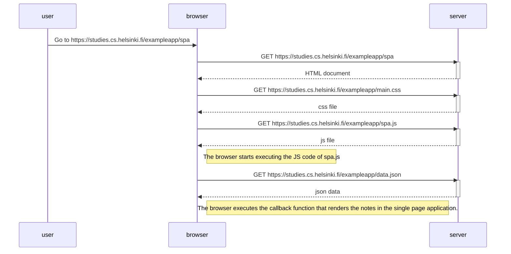

```mermaid
sequenceDiagram
    participant user
    participant browser
    participant server

    user->>browser: Go to https://studies.cs.helsinki.fi/exampleapp/spa
    browser->>server: GET https://studies.cs.helsinki.fi/exampleapp/spa
    activate server
    server-->>browser: HTML document
    deactivate server

    browser->>server: GET https://studies.cs.helsinki.fi/exampleapp/main.css
    activate server
    server-->>browser: css file
    deactivate server

    browser->>server: GET https://studies.cs.helsinki.fi/exampleapp/spa.js
    activate server
    server-->>browser: js file
    deactivate server

    Note right of browser: The browser starts executing the JS code of spa.js

    browser->>server: GET https://studies.cs.helsinki.fi/exampleapp/data.json
    activate server
    server-->>browser: json data
    deactivate server

    Note right of browser: The browser executes the callback function that renders the notes in the single page application.

```
